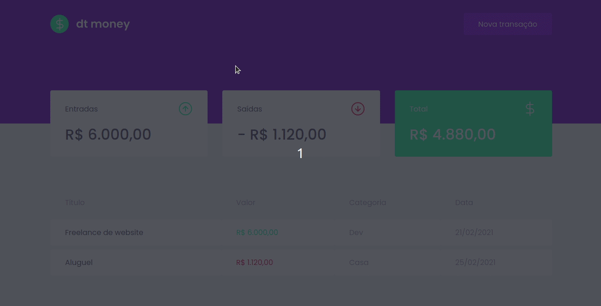

<p align="center">
  
</p>

# dt money

Created with [Typescript](https://github.com/microsoft/TypeScript/), [React JS](https://github.com/facebook/react) and using the [Style Components](https://github.com/styled-components/styled-components) library.

An expense management application. Capital inflows and outflows are added and listed. A summary with the values ​​is also displayed.


## What was done

- Modal to add a transaction (inflow or outflow of money)
- Adding and listing transactions
- Summary with total value information
  - Total cash inflow
  - Total cash outflows
  - Total cash

## Some concepts and libs used

- The application dhas no API, so the [Mirage JS](https://github.com/miragejs/miragejs) was used to serve some data
- The componentization concept was used
- The library **Style Components** was used
- The Context API from React was also used

---


## How to run the project

> :information_source: First of all, you need to have **npm** (or yarn) and **Git** installed on your machine

```bash
# (Using yarn as an example)

# Clone the project on your machine
> git clone https://github.com/vitumenezes/dtmoney

# Enter the folder
> cd github-explorer

# Install the dependencies
> yarn install

# Run the project
> yarn start
```

The project will run on your localhost on port 3000 by default. So just access your browser at [http://localhost:3000](http://localhost:3000) to view.

## That's it! Want to contribute?

- Make a fork of this repo;
- Create a branch with your feature: `git checkout -b my-feature`;
- Commit your changes: `git commit -m 'feat: my new feature'`;
- Push your new branch: `git push origin my-feature`.
- Go to Github and you will see the **Compare & pull request** button;
- Click it and make your Pull Request!

## LICENSE

MIT License. See [LICENSE.md](LICENSE.md) to check details.

---

<p align="center">
<b>Always made with love :heart: </b><br/><br/>
  

  

</p>
